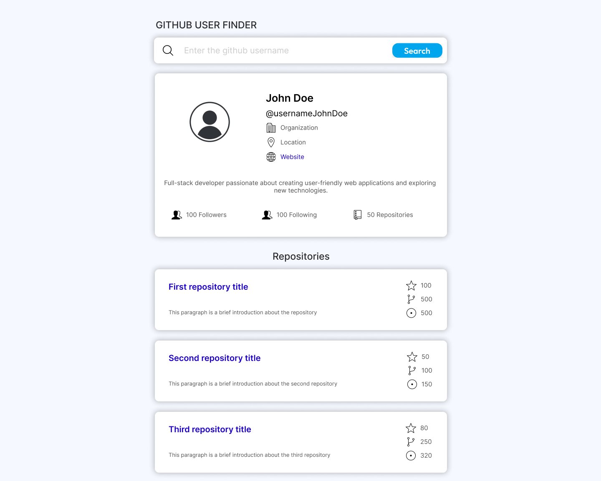
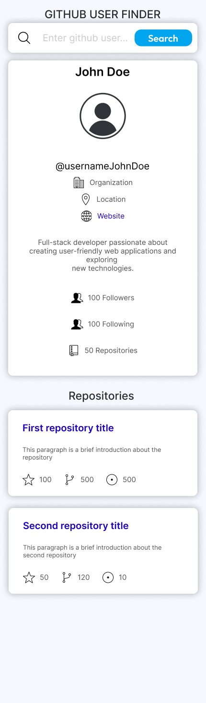

## Assessment

Your assessment is to build out this GitHub user search web app using the [GitHub users API](https://docs.github.com/en/rest/reference/users#get-a-user) and get it looking as close to the design as possible given the following layout for both desktop and tablet design (one layout) and mobile layout (one layout)

### Design for a Desktop and Tablet

### Design for a Mobile device

## Figma file

If you wish to download a copy of the figma file and import it to your Drafts, [click here](https://drive.google.com/file/d/1F2Qs9HYa9kEwIg-mbnl9RBHBFLSk2i0Z/view?usp=sharing)

## Icons

All icons for the web app are located in the public/images route, you can use the [Image component](https://nextjs.org/docs/app/api-reference/components/image) from Next JS App Router

## Styling

If you are familiar with [Tailwind CSS](https://tailwindcss.com/) it is recommended to use it, however, plain CSS would be also accepted

## Expected behavior

- Display an error message and clean every label if a user is not found.
- If a GitHub user hasn't added their name, show their username where the name would be without the `@`.
- If a GitHub user's bio is empty, show the text "This profile has no bio".
- If a Github user's profile picture is empty use the default picture for empty profile (no_image.png)
- If any of the location, website, Twitter, or company properties are empty, show the text "Not Available" with gray font color.
- Website, Twitter, and company information should all be links to those resources by opening in a new tab when a user clicks in it.

# Important to know

- Take in consideration when doing the assessment, the public Github API Search has a limit of 60 attempts for every hour as described in the [following link](https://docs.github.com/en/rest/using-the-rest-api/rate-limits-for-the-rest-api?apiVersion=2022-11-28#primary-rate-limit-for-unauthenticated-users).
